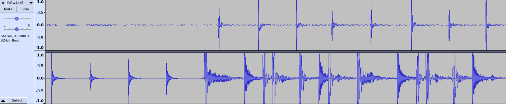

# Recorder

Record audio from your microphone and mix it with local audio in the browser.

When you press record the video will start playing and the both the audio from the video and the audio from your microphone will be recorded. I have used the MediaRecorder for this:

```typescript
// 1
const streamMic = await navigator.mediaDevices.getUserMedia({ audio: true });
// 2
const microphoneInput = audioContext.createMediaStreamSource(streamMic);
const audioTrackVideo = audioContext.createMediaElementSource(video);
// 3
const recordingDestination = audioContext.createMediaStreamDestination();
// 4
microphoneInput.connect(recordingDestination);
audioTrackVideo.connect(audioContext.destination);
// 5
const recorder = new MediaRecorder(recordingDestination.stream);
```

What happens here is that we first try to get access to the audio stream from your microphone (1), then we convert both the audio stream from your microphone and from the video element to AudioNode instances (2) so we are able to route them (add them to an audio routing graph). We create a destination that accepts streams (3). We connect both streams to this new destination (4) and feed this combined stream to the MediaRecorder (5).

So we add tracks to a destination and then feed the stream of that destination to the MediaRecorder. Another approach would be to add the tracks directly to the MediaStream:

```typescript
const stream = new MediaStream();
stream.addTrack(streamMic.getTracks()[0]);
stream.addTrack(recordingDestination.stream.getAudioTracks()[0]);
```

But that doesn't work (yet). Firefox prints a warning:

> MediaRecorder does not support recording multiple tracks of the same type at this time.

And Chrome only adds the first audio track.

## Browser and OS support

When you record audio from your microphone there is latency; this is the time it takes the signal to travel from your microphone, to your soundcard, through the A/D converter, to your computer, to your browser and all the way back to the D/A converter to finally arrive in your headphones. This latency is dependent on your soundcard and the drivers of that soundcard. Nowadays soundcard drivers aren't very common anymore; on Windows WindowsAudio takes care of your soundcard and on MacOS it is handled by CoreAudio. On Linux it is usually handled by ALSA.

CoreAudio does an amazing job; even with very cheap soundcard you get a very low latency. On Windows the results vary; in general you get lower latency with better cards. On Linux the latency is dependent on many factors; best results are to be expected with low-latency kernels or distributions that are tailored to media production such as [Ubuntu Studio](https://ubuntustudio.org/) or [64Studio](https://64studio.com/).



Live example:

<https://abudaan.github.io/recorder/dist/>
